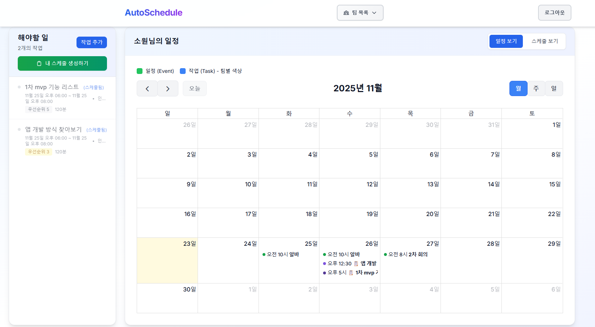
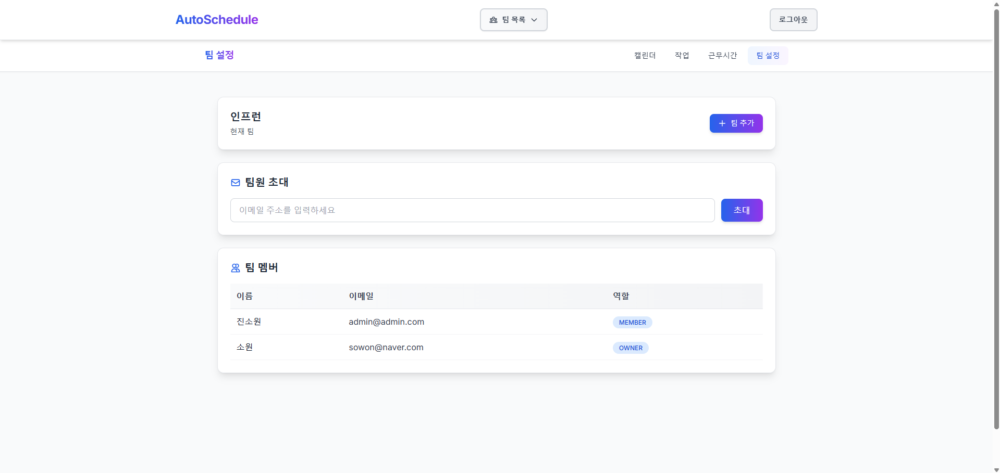
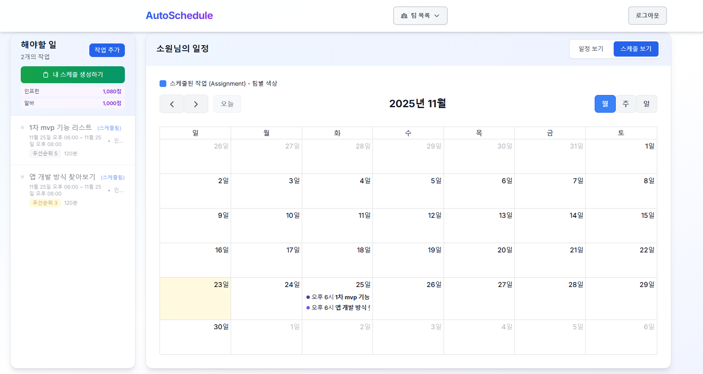
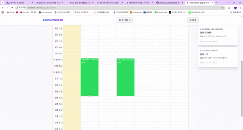

# AutoSchedule

> 팀 단위 회의·일정·작업시간을 AI가 자동으로 최적화해주는 협업 스케줄 관리 시스템

---

## 프로젝트 소개

AutoSchedule은 팀 협업을 위한 지능형 일정 관리 플랫폼입니다. 복잡한 팀 일정을 AI가 자동으로 분석하고 최적화하여, 모든 팀원의 일정을 효율적으로 조율합니다. 실시간 협업 기능을 통해 팀원들과 함께 일정을 관리하고, 드래그 앤 드롭으로 간편하게 일정을 조정할 수 있습니다.

---

## 배포 정보

이 프로젝트는 AWS EC2에 배포되어 있으며, 아래 주소로 접속하여 바로 사용할 수 있습니다.

**접속 URL**: [http://54.206.65.33:8080](http://54.206.65.33:8080)

---

## 주요 화면

### 1. 메인 대시보드

팀의 전체 일정을 한눈에 볼 수 있는 메인 화면입니다. 캘린더 뷰를 통해 월별, 주별, 일별 일정을 확인하고 관리할 수 있습니다.



- **FullCalendar 통합**: 직관적인 캘린더 인터페이스로 일정을 시각화
- **실시간 동기화**: WebSocket을 통한 실시간 일정 업데이트
- **팀 멤버 일정 확인**: 팀원들의 일정을 한 화면에서 확인

---

### 2. 팀 설정

팀을 생성하고 멤버를 초대하여 협업을 시작할 수 있습니다. 각 팀원의 근무 시간과 선호도를 설정하여 더욱 정확한 스케줄링이 가능합니다.



- **팀 관리**: 팀 생성 및 멤버 초대 기능
- **근무 시간 설정**: 각 팀원의 근무 시간대 설정
- **선호도 관리**: 개인별 일정 선호도 설정

---

### 3. 일정 생성 및 자동 스케줄링

AI가 팀원들의 일정을 분석하여 최적의 회의 시간을 자동으로 제안합니다. 우선순위와 제약 조건을 고려하여 스마트하게 일정을 생성합니다.



- **자동 스케줄링**: AI 기반 최적 일정 자동 생성
- **우선순위 기반**: 중요도와 우선순위를 고려한 일정 배치
- **즉시 제안**: 제약 조건을 빠르게 분석하여 가능한 시간대 제안

---

### 4. 드래그 앤 드롭 일정 조정

캘린더에서 일정을 마우스로 드래그하여 간편하게 시간을 변경할 수 있습니다. 직관적인 조작으로 빠르게 일정을 수정할 수 있습니다.



- **직관적인 조작**: 드래그 앤 드롭으로 일정 시간 변경
- **자동 저장**: 변경 사항이 자동으로 저장되고 동기화
- **부드러운 애니메이션**: 자연스러운 인터랙션 경험

---

## 핵심 기능

### 실시간 협업
- WebSocket 기반 실시간 일정 동기화
- 여러 사용자가 동시에 일정을 수정해도 충돌 없이 관리
- 실시간 알림으로 팀원들의 일정 변경사항 즉시 확인

### AI 자동 스케줄링
- 팀원들의 일정 패턴 분석
- 우선순위와 제약 조건을 고려한 최적 일정 제안
- 회의 시간 자동 조율

### 직관적인 UI/UX
- FullCalendar를 활용한 시각적 캘린더
- 드래그 앤 드롭으로 간편한 일정 수정
- 반응형 디자인으로 모바일에서도 사용 가능

---

## 기술 스택

| 영역 | 기술 |
|------|------|
| **Backend** | Java 17, Spring Boot 3.3.5, Spring Data JPA, Spring WebSocket |
| **Database** | PostgreSQL 18, Flyway (DB 마이그레이션) |
| **Frontend** | React 19, TypeScript, Tailwind CSS, FullCalendar |
| **인증/보안** | Spring Security, JWT |
| **실시간 통신** | WebSocket (STOMP), SockJS |
| **인프라** | AWS EC2, Nginx |

---

## 프로젝트 구조

```
sbb/
├── src/main/java/com/example/sbb/
│   ├── controller/                    # REST API 컨트롤러
│   │   └── support/                   # 컨트롤러 지원 클래스
│   ├── service/                       # 비즈니스 로직
│   ├── domain/                        # JPA 엔티티
│   ├── repository/                    # 데이터 접근 계층
│   ├── dto/                           # 데이터 전송 객체
│   │   ├── request/                   # 요청 DTO
│   │   ├── response/                  # 응답 DTO
│   │   └── event/                     # WebSocket 이벤트 메시지
│   ├── config/                        # 설정 (Security, WebSocket 등)
│   ├── exception/                     # 예외 처리
│   └── util/                          # 유틸리티 클래스
├── src/main/resources/
│   ├── application.properties         # 애플리케이션 설정
│   ├── db/migration/                  # Flyway 마이그레이션 스크립트
│   ├── static/                        # 정적 리소스
│   └── templates/                     # 템플릿 파일
├── frontend/                          # React 프론트엔드
│   ├── src/
│   │   ├── pages/                     # 페이지 컴포넌트
│   │   │   └── team/                  # 팀 관련 페이지
│   │   ├── components/                # 재사용 컴포넌트
│   │   ├── lib/                       # API 및 WebSocket 클라이언트
│   │   ├── store/                     # 상태 관리 (Zustand)
│   │   └── assets/                    # 이미지 및 리소스
│   ├── dist/                          # 빌드 결과물
│   └── package.json
├── docs/assets/                       # 프로젝트 이미지 및 문서
├── build.gradle                       # Gradle 빌드 설정
└── settings.gradle                    # Gradle 프로젝트 설정
```

---

## 시작하기

### 필수 요구사항
- Java 17 이상
- Node.js 18 이상
- PostgreSQL 18
- Gradle

### 실행 방법

1. **데이터베이스 설정**
   ```bash
   # PostgreSQL 데이터베이스 생성
   createdb sbb
   ```

2. **백엔드 실행**
   ```bash
   ./gradlew bootRun
   ```

3. **프론트엔드 실행**
   ```bash
   cd frontend
   npm install
   npm run dev
   ```

4. **브라우저에서 접속**
   ```
   http://localhost:5173
   ```

---

## 개발 일정

| 주차 | 목표 |
|------|------|
| Week 1 | DB 설계 및 CRUD API 완성 |
| Week 2 | 실시간 협업 + 캘린더 연동 |
| Week 3 | 자동 스케줄링 로직 완성 |
| Week 4 | 배포 및 프로젝트 마무리 |

---

## 참고 링크

- [개발 블로그 - AutoSchedule 기록](https://sowon02.tistory.com/)

---

## 라이선스

이 프로젝트는 개인 학습 및 포트폴리오 목적으로 개발되었습니다.
